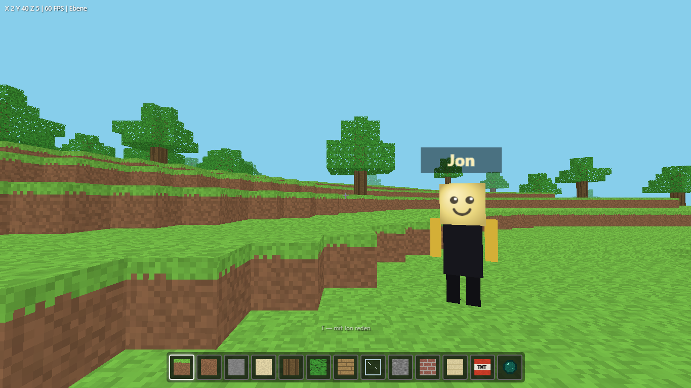

<div align="center">


# Jon — AI Desktop Assistant

**An assistant that doesn't just talk — it actually operates your PC.**

[](CHANGELOG.md)
[](https://getjon.info)
[](LICENSE)
[](https://getjon.info)

[](https://github.com/Lightning702/Jon---AI/releases/latest/download/Jon-Setup.exe)
[](https://github.com/Lightning702/Jon---AI/releases/latest/download/Jon-Windows.zip)
[](https://getjon.info)

🇩🇪 [Deutsche Version](README.md) · 📖 [Changelog](CHANGELOG.md) · 🛠️ [Setup](#setup)

</div>

---

Jon is a modern AI desktop assistant for Windows with multi-provider support,
streaming, long-term persistence, real system control, mouse/keyboard automation,
voice control, an editable skill system and a standalone phone app. Backend in
Python/FastAPI, frontend in Electron + React + TypeScript in a black/gold glassmorphism
design.

<div align="center">

### 🎬 Installing Jon in two minutes

[](https://www.youtube.com/watch?v=tjVsXAmi750)

*The video is in German — the steps are the same. Click the image to watch.*

</div>

---

## 🕹️ Three games. Two players. One friend code.

The **FelWorks Game Collection** ships inside Jon — and since v3.34 you play all of it
together over a six-character code.

<table>
<tr>
<td width="50%" align="center">

<br><b>ECHO</b><br><sub>Psychological horror · 4 floors · 464 rooms · five endings</sub>
</td>
<td width="50%" align="center">

<br><b>AETHERIA</b><br><sub>Fantasy open world · villages, quests, world map</sub>
</td>
</tr>
<tr>
<td width="50%" align="center">

<br><b>Blockwelt</b><br><sub>Voxel sandbox where Jon builds for you</sub>
</td>
<td width="50%" align="center">

<br><b>Online co-op</b><br><sub>Shared world, ping display, team chat</sub>
</td>
</tr>
</table>

---

## Download Jon

| | Ready-made | From source |
| --- | --- | --- |
| For whom | just use it | contribute, Pi, Linux |
| Prerequisites | none | Python 3.12+, Node.js 20+ |
| Time | ~2 minutes | ~10 minutes |

**Ready-made** — from [getjon.info](https://getjon.info) or the
[GitHub releases](https://github.com/Lightning702/Jon---AI/releases/latest):

- **Jon-Setup.exe** — installer with start menu and desktop shortcut
- **Jon-Windows.zip** — portable: unzip, run `Jon.exe`

Both contain the Jon app, Mini Jon, the full backend (starts automatically) and the
games. No Python, no Node.js, no `.env` — you enter API keys inside the app under
**Accounts**. See [installing with the .exe](#installing-with-jon-setupexe) below.

**From source** — clone the repository and follow the [setup guide](#setup):

```bash
git clone https://github.com/Lightning702/Jon---AI.git
```

**Requirements:** Windows 10/11, [Python](https://www.python.org/downloads/) 3.12+ and
[Node.js](https://nodejs.org/) 20+.

**No installation:** The phone app runs directly in the browser at
[https://getjon.info/app](https://getjon.info/app/).

---

## Features

- **🙂 Mini Jon** — Jon's little son lives as a cute glowing circle on your desktop:
  always on top, movable, there from Windows startup. He greets you with updates, listens
  continuously (say "Jon" once, then just keep talking), speaks with lip-sync, and can do
  everything the big Jon can. Face, colours, eyes and size are fully customizable.
- **🗣️ Voice control** — Offline wake-word detection ("Jon") via openWakeWord in the
  backend, with automatic fallback to in-window recognition. Barge-in: talk while Jon is
  speaking and he stops instantly. Sensitivity is adjustable in the gear menu.
- **🧰 Real system control** — PowerShell/CMD, launch/kill programs, read/write/move/delete
  files, mouse and keyboard automation, screenshots, window management.
- **🗑️ Trash & action log** — Deletes, overwrites and moves are backed up to `data/trash`
  first (kept 30 days). `/undo` restores the last file action, `/trash` lists everything.
  Every tool call is logged with source (app, Mini Jon, Telegram, automation, watcher);
  `/log` shows the recent actions with filters.
- **🌐 Browser automation** — Jon drives a visible Chromium window (Playwright):
  `browser_goto/click/fill/read/screenshot/back/close`. He reads a page before clicking and
  never logs in or buys anything without explicit confirmation.
- **📅 Calendar** — A local calendar (month/week view) in the black/gold design. Jon adds,
  moves and searches appointments by voice ("Add dentist Friday 3pm"), warns about
  conflicts, and shows automations, reminders and your connected ICS calendar side by side.
  `/calendar` shows the next 7 days.
- **🔄 Auto-update** — `/update` pulls the latest version, backs up `data/` first, reinstalls
  only what changed, and restarts (on the Raspberry Pi via `systemctl restart jon`).
- **🕹️ Games built in** — The FelWorks Game Collection ships with Jon: **ECHO**
  (first-person psychological horror) and **AETHERIA** (fantasy open-world RPG) run as
  their own window, the **Blockwelt** voxel sandbox opens in a browser tab. Find them under
  Tools → Games; nothing launches on its own, only the **Start** button opens a game and Jon
  stays open. Drop a folder with a `jon-spiele.json` next to Jon to add your own.
- **🌍 English & German** — Switch the whole UI and Jon's replies between German and English
  in the gear menu.
- Plus: knowledge base, automations, reminders, friends chat, Telegram bot (with photo
  analysis and direct mouse/keyboard control), evening show, password vault, flashcards,
  and more.

---

## Setup

### Installing with `Jon-Setup.exe`

**1. Download**

[⬇ Jon-Setup.exe](https://github.com/Lightning702/Jon---AI/releases/latest/download/Jon-Setup.exe)
(~280 MB). Prefer not to install anything?
[Jon-Windows.zip](https://github.com/Lightning702/Jon---AI/releases/latest/download/Jon-Windows.zip)
is portable — unzip, run `Jon.exe`, skip steps 2 and 3.

**2. Dismiss the Windows warning**

SmartScreen shows *"Windows protected your PC"* on first run. That is not a virus — the
file simply isn't signed with a paid certificate. Click **More info** → **Run anyway**.
The full source is in this repository, so you can always build Jon yourself.

**3. Install**

The installer asks for a target folder, creates start menu and desktop shortcuts and
launches Jon afterwards. It installs **per user**, so no administrator rights are needed.
Included: the Jon app, Mini Jon, the complete backend and the FelWorks Game Collection.

**4. Add an API key**

Without a key Jon cannot think. In the app: **person icon (top right) → Accounts** →
pick a provider → paste the key → save. Jon then lists every available model by itself.

A free start: [build.nvidia.com](https://build.nvidia.com) → create an account →
generate an API key (starts with `nvapi-`). Keys are stored locally in `accounts.json`
only — never in the repository, never in a cloud.

> **Tip:** Jon and Mini Jon use separate models. With **one** key they share it. Enter
> **two keys separated by a comma** and the first belongs to Mini Jon and Telegram, the
> second to Jon — then they never slow each other down.

**5. Get going**

- `Ctrl+Alt+J` — show/hide the Jon window
- `Ctrl+Alt+Space` — quick question anywhere on screen
- `Ctrl+Alt+K` — Mini Jon on/off
- **Tools → Games** or `/spiele` — ECHO, AETHERIA, Blockwelt

**Where is my data?** Everything lives in `%LOCALAPPDATA%\Jon\data` — chats, memory,
accounts, knowledge base, save games. Updates never touch that folder.

**Quitting.** The **X** shuts Jon down completely, backend included. To keep him running
in the background (hotkeys stay active), use the **⌄** button next to it or the tray
entry *Im Hintergrund weiterlaufen*.

**Updating.** `/update` in the chat: Jon downloads the new version himself, verifies it,
asks once, closes and installs. He restarts on his own afterwards; your data stays.

**Uninstalling.** Windows Settings → *Apps* → **Jon** → Uninstall. The data folder stays
on purpose — delete `%LOCALAPPDATA%\Jon` by hand to remove everything.

---

### From source

#### 1. Environment variables

```bash
cp .env.example .env
```

Put your API keys in `.env`. **Keys never belong in source code.** Alternatively connect
providers at runtime in the accounts area.

```
NVIDIA_API_KEY=nvapi-...
DEFAULT_PROVIDER=nvidia
DEFAULT_JON_MODEL=openai/gpt-oss-120b
DEFAULT_EMIL_MODEL=openai/gpt-oss-20b
```

#### 2. Backend

```bash
cd backend
python -m pip install -r requirements.txt
python -m app.main
```

Backend: `http://127.0.0.1:8756` — API docs: `http://127.0.0.1:8756/docs`.

#### 3. Frontend

```bash
cd frontend
npm install
npm run dev
```

`npm run dev` starts Vite and Electron together. `npm run build` creates a production
build, `npm run package` a Windows installer (electron-builder).

Details and troubleshooting: [docs/DEVELOPMENT.md](docs/DEVELOPMENT.md).

### Always on: Jon on a Raspberry Pi

To reach Jon around the clock from phone and smartwatch — even when the PC is off — the
backend can run on a Raspberry Pi (Pi 4 or newer):

1. `git clone https://github.com/Lightning702/Jon---AI.git jon`
2. `cd jon && bash pi-installieren.sh`
3. Enter API keys: `nano .env`, then `sudo systemctl restart jon`

The script installs everything, builds the web app and sets up a systemd service that
starts automatically on boot. Reach Jon at `http://<Pi-IP>:8756/app`.

---

## Security

- API keys live only in your local `.env` or the local account store, never in the code.
- All system control respects the approval mode ("ask first" / "allow all").
- `JON_LAN=1` exposes Jon to your local network — only enable it in a trusted network.
- The trash keeps deleted files for 30 days so mistakes are recoverable.
