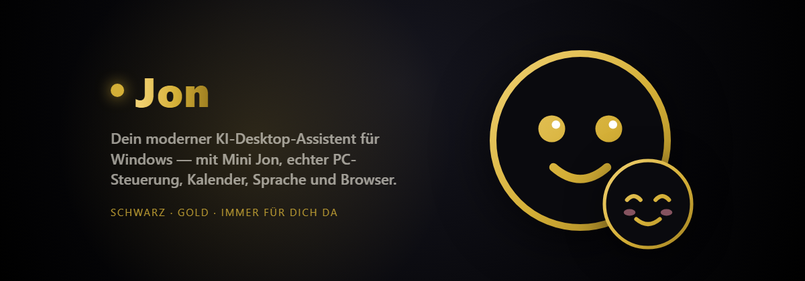

# Jon — KI-Desktop-Assistent



🇬🇧 **English version: [README.en.md](README.en.md)**

Jon ist ein moderner KI-Desktop-Assistent für Windows mit Multi-Provider-Unterstützung,
Streaming, Langzeit-Persistenz, echter Systemsteuerung, Maus-/Tastatur-Automatisierung,
Sprachsteuerung, einem bearbeitbaren Skill-System und einer eigenständigen Handy-App.
Backend in Python/FastAPI, Frontend in Electron + React + TypeScript im
Black/Gold-Glassmorphism-Design. (Claude hat es nur veröffentlicht, weil ich nicht wusste
wie das geht. Er hat auch bisschen geholfen.)

**Website & Download: [https://getjon.netlify.app](https://getjon.netlify.app)**

---

## Inhalt

- [Jon herunterladen](#jon-herunterladen)
- [Funktionen](#funktionen)
- [Was Jon steuern kann (Tools)](#was-jon-steuern-kann-tools)
- [Skills](#skills)
- [Konten & Modelle](#konten--modelle)
- [Nutzung /usage](#nutzung-usage)
- [Handy-App](#handy-app)
- [Setup](#setup)
- [Dokumentation](#dokumentation)
- [Sicherheit](#sicherheit)

---

## Jon herunterladen

Der einfachste Weg zu Jon führt über die offizielle Website:

1. Öffne **[https://getjon.netlify.app](https://getjon.netlify.app)**
2. Klicke auf **Download** — du erhältst die Datei `jon.zip`
3. Entpacke die Zip-Datei an einen Ort deiner Wahl (z. B. `C:\Jon`)
4. Folge danach der [Setup-Anleitung](#setup) weiter unten
5. Nach dem Setup startet ein Doppelklick auf `start-jon.bat` Backend und App zusammen

Alternativ das Repository direkt klonen:

```bash
git clone https://github.com/Lightning702/Jon---AI.git
```

**Voraussetzungen:** Windows 10/11, [Python](https://www.python.org/downloads/) 3.12 oder
neuer und [Node.js](https://nodejs.org/) 20 oder neuer.

**Ohne Installation:** Die Handy-App läuft direkt im Browser unter
[https://getjon.netlify.app/app](https://getjon.netlify.app/app/).

---

## Funktionen

- **🙂 Mini Jon (Jon Jr)** — Jons kleiner Sohn lebt als niedlicher, minimalistischer Kreis
  direkt auf deinem Desktop: immer im Vordergrund, verschiebbar, beim Windows-Start schon da.
  Er begrüßt dich mit Updates, **hört durchgehend zu** (sag einmal „Jon", dann redest du
  einfach weiter), **spricht mit lippensynchronem Mund**, und **kann alles, was der große Jon
  kann** (Web-Suche, Dateien, PC-Steuerung …). Sein Gesicht, seine Farben, Augen und Größe
  sind frei anpassbar (🎨-Knopf), und im hellen Modus wird auch er weiß. Er hat — wie der
  große Jon — seine eigene Persönlichkeit und Familiengeschichte. Ein-/Ausblenden mit
  `Strg+Alt+K`
- **Persönlichkeit & eigenes Gedächtnis** — Jon ist kein neutraler Bot: eigener Charakter,
  Stimmungen, Lebensgeschichte und eine eigene `MEMORY.md`, in die er selbst schreibt
- **KI-Team, Simulationen, Zeitreise & Dream Mode** — `/team`, `/simulate`, `/snapshot(s)`,
  `/dream(s)` (siehe Befehle-Tab im Nutzer-Menü)
- **📚 Wissensbasis (RAG)** — „Jon, lern dieses PDF/diesen Ordner": lokale, durchsuchbare
  Wissensbasis (komplett offline), aus der Jon beim Antworten zitiert
- **🌅 Tagesbriefing** — täglich beim ersten Start und per `/briefing`: Wetter (Stadt im
  Zahnrad-Menü), Erinnerungen, Wecker und geplante Automationen
- **⚡ Schnellfrage-Overlay** — `Strg+Alt+Leertaste` öffnet überall ein kleines
  Spotlight-Fenster: Frage tippen, Antwort erscheint sofort, `Esc` schließt
- **📋 Clipboard-Historie** — die letzten 50 kopierten Einträge, lokal gespeichert,
  durchsuchbar über den 📋-Knopf oder `/clipboard`, mit einem Klick wieder kopiert
- **🤖 Echte Automationen** — „Räum jeden Tag um 18 Uhr meinen Downloads-Ordner auf":
  Jon führt geplante Aufgaben zur Uhrzeit wirklich aus und berichtet (`/tasks`)
- **📎 Datei-Anhänge im Chat** — PDFs, Bilder und Textdateien per Drag & Drop oder
  Büroklammer: PDFs werden gelesen, Bilder vom Vision-Modell beschrieben
- **🎁 Zeitkapseln** — Nachrichten an dein zukünftiges Ich: Jon versiegelt sie mit seiner
  aktuellen Stimmung und übergibt sie feierlich am Zieltag
- **📷 Webcam-Blick** — „Jon, was siehst du über meine Webcam?": Jon macht ein Webcam-Foto
  und antwortet garantiert mit einer Beschreibung — ausschließlich auf deine Bitte und nur,
  wenn du im Zahnrad-Menü „Webcam erlauben" aktiviert hast (Standard: aus)
- **💬 Immer im Gespräch** — Jon und Mini Jon beenden jede Antwort mit einer kurzen
  Rückfrage oder einem nächsten Vorschlag (abschaltbar: einfach sagen)
- **📧 E-Mail & Kalender** — IMAP-Postfach und ICS-Kalender: ungelesene Mails im
  Tagesbriefing, Mails vorlesen und beantworten, Termine abfragen
- **📲 Telegram-Fernbedienung** — Schreib Jon von unterwegs: Er steuert deinen PC und
  antwortet aufs Handy — weltweit, ohne VPN, gratis
- **👀 Datei-Wächter** — „Sortiere neue Downloads automatisch": Jon reagiert, sobald neue
  Dateien in einem Ordner auftauchen
- **🎵 Medien-Steuerung** — „leiser", „nächster Song", „Pause" über die Windows-Medientasten
  (funktioniert mit Spotify, YouTube, allem)
- **🗣️ Natürliche Stimme** — echte Neural-Stimme statt Roboterstimme (gratis), optional
  Offline-Spracherkennung mit Whisper
- **📊 Wochenrückblick** — jeden Sonntag ein persönlicher Rückblick von Jon (`/woche`)
- **🩺 PC-Gesundheitscheck** — `/check`: Speicherplatz, RAM-Fresser, Autostart, Temp-Müll —
  mit Aufräum-Vorschlägen, die Jon direkt umsetzt
- **🏠 Smart Home** — Home Assistant: „Jon, mach das Licht aus"
- **🌐 Netzwerk & Drucker** — Geräte im WLAN finden, per Wake-on-LAN aufwecken, Dateien
  ausdrucken („Druck mir das aus")
- **👤 Profil** — beim ersten Start fragt Jon nach deinem Namen und spricht dich fortan
  damit an; jederzeit änderbar
- **💬 Freunde-Chat (Peer-to-Peer)** — Nachrichten, Bilder, Videos, **Sprachnachrichten**
  (auf Wunsch als Text statt zum Anhören) und **Gruppen**. Direkt von PC zu PC, **Ende-zu-Ende
  verschlüsselt**, ohne Cloud und ohne Kosten. Unbekannte müssen erst eine
  **Freundschaftsanfrage** stellen. Über das Relay erreichst du auch Freunde im Internet —
  und Jon schreibt auf Zuruf für dich („Sag Anna, dass ich später komme")
- **Coding-Agent** — als **„Jon Code"-Modus in der App** (Button oben rechts: Dateibaum +
  Editor + Jon-Agent rechts, mit `/model`- und `/provider`-Wechsel) und als **`jon`-Befehl
  im VS-Code-Terminal**. Jon arbeitet an ganzen Projekten wie ein moderner KI-Coding-Agent
  und bleibt dabei technisch auf den gewählten Projektordner begrenzt — Zugriffe außerhalb
  werden blockiert (siehe [docs/CLI.md](docs/CLI.md))
- **Multi-Provider-Chat** mit einheitlicher Schnittstelle: NVIDIA, OpenAI, Anthropic,
  Gemini, **Ollama & LM Studio (lokal, gratis)**, OpenRouter, Groq, Together AI, xAI,
  DeepSeek, GLM, Qwen, Mistral
- **Erinnerungen/Loops**: „Erinnere mich jeden Tag um 13 Uhr ans Trinken" — Jon meldet sich,
  sobald die App offen ist, mit Chat-Nachricht und Browser-Benachrichtigung
- **Eigenes Prompt & eigene Skills** direkt in der App (Konten → Prompt / Skills)
- **Echtes Token-Streaming** (Server-Sent Events), inklusive separatem Denkprozess
  (`reasoning_content`)
- **Modell- und Providerwechsel** zur Laufzeit; automatische Modell-Erkennung pro Anbieter
- **Großes Antwortlimit** (bis 32.768 Tokens) mit automatischer Anpassung an Modellgrenzen
- **Echtes Tool-/Function-Calling** — Jon steuert den PC wirklich (siehe unten)
- **Freigabe-Modus**: „Zuerst fragen" (Standard) oder „Alles erlauben", dauerhaft gespeichert
- **Aufklappbare Tool-Anzeige**: jede Aktion zeigt auf Klick den genauen Befehl und eine
  kurze Erklärung
- **Maus-/Tastatur-Automatisierung** über PyAutoGUI (Multi-Monitor)
- **Sprachsteuerung** mit Wake-Word „Jon" und Text-to-Speech-Antworten
- **Langzeitgedächtnis**: Jon merkt sich Fakten über alle Unterhaltungen hinweg
- **Skill-System**: bearbeitbare Markdown-Anleitungen (z. B. Web-Design)
- **Konten-Bereich**: Provider offiziell per API-Key verbinden, Modelle wählen
- **Nutzungs-Übersicht** `/usage`: real gemessene Tokens, Anfragen, Antwortzeiten
- **Handy-App (PWA)**: Chat, Apps öffnen, Teilen, Vorlesen, Spracheingabe, Bildanalyse
- **Website & Netlify-Deployment** inklusive Handy-Proxy für NVIDIA

---

## Was Jon steuern kann (Tools)

Jon ruft echte Funktionen auf dem PC auf. Jede Aktion ist im Chat als Chip sichtbar und
auf Klick aufklappbar (Befehl + Erklärung + Ergebnis).

| Bereich | Tools |
|---------|-------|
| Shell | `run_powershell`, `run_cmd` |
| Programme | `start_program`, `kill_program`, `open_url`, `open_in_vscode` |
| Dateien | `list_dir`, `read_file`, `write_file`, `append_file`, `move_path`, `copy_path`, `delete_path`, `make_dir`, `search_files` |
| Archive | `zip_paths`, `unzip` |
| System | `system_info`, `list_processes`, `lock_screen`, `open_explorer` |
| Zwischenablage | `clipboard_get`, `clipboard_set`, `clipboard_history` |
| E-Mail & Kalender | `check_mail`, `read_mail`, `send_mail`, `get_calendar` |
| Musik & Medien | `media_control`, `spotify_play`, `spotify_search`, `spotify_now_playing`, `amazon_play`, `amazon_now_playing` |
| Datei-Wächter | `add_watcher`, `list_watchers`, `delete_watcher` |
| Smart Home | `smarthome_devices`, `smarthome_control` |
| Netzwerk & Drucker | `scan_network`, `wake_device`, `list_printers`, `print_file` |
| Wissensbasis | `learn_document`, `ask_knowledge`, `list_documents`, `forget_document` |
| Automationen | `add_task`, `list_tasks`, `delete_task` |
| Zeitkapseln | `time_capsule`, `list_capsules` |
| Bildschirm | `screenshot`, `get_screen_info` |
| Webcam | `webcam_look` |
| Web | `http_get`, `download_file` |
| Maus/Tastatur | `mouse_move`, `mouse_click`, `mouse_scroll`, `keyboard_type`, `keyboard_press`, `keyboard_hotkey` |
| Fenster | `list_windows`, `focus_window`, `wait` |
| Gedächtnis | `remember`, `recall`, `forget` |
| Skills | `list_skills`, `read_skill`, `write_skill` |

Standardmäßig fragt Jon vor jeder Aktion um Erlaubnis. Reine Abfragen (Systeminfo, Fenster
auflisten, Skill lesen, Erinnerung abrufen) laufen ohne Rückfrage. Der Modus ist im
Zahnrad-Menü umstellbar. Alle Tools sind in [docs/API.md](docs/API.md) dokumentiert.

---

## Skills

Skills sind **bearbeitbare Markdown-Anleitungen** im Ordner `skills/`. Jon liest die
passende Anleitung, bevor er eine Aufgabe startet, und folgt ihr. Du kannst sie in der App
(Konten → Skills), in jedem Texteditor oder direkt in der entpackten ZIP bearbeiten.

Mitgeliefert:

- **web-design** — wie Jon moderne, responsive Websites baut
- **pc-automation** — zuverlässige Maus-/Tastatur-Steuerung
- **research** — sauberes Nachschlagen und Zusammenfassen

Mehr dazu in [docs/SKILLS.md](docs/SKILLS.md).

---

## Verbindungen einrichten

Alle Verbindungen sind **kostenlos** — du zahlst nur für deine LLM-API (oder gar nichts,
wenn du Ollama nutzt). Öffne dazu **Zahnrad-Menü → 🔌 Verbindungen**. Alles wird nur lokal
auf deinem PC gespeichert.

| Verbindung | Was du brauchst | Wo du es herbekommst |
|---|---|---|
| 📧 **E-Mail** | IMAP-Server, Adresse, App-Passwort | Gmail: `imap.gmail.com` + [App-Passwort](https://myaccount.google.com/apppasswords) (nicht dein normales Passwort!). GMX/Web.de: IMAP zuerst in den Konto-Einstellungen freischalten |
| 📅 **Kalender** | ICS-URL | Google Kalender → Einstellungen → *Geheime Adresse im iCal-Format*. Geht auch mit Outlook, Apple, Nextcloud |
| 📲 **Telegram** | Bot-Token | In Telegram `@BotFather` anschreiben → `/newbot` → Namen wählen → Token kopieren. Danach **deinem eigenen Bot** `/start` schreiben — der erste Chat wird automatisch mit deinem PC verknüpft, alle anderen werden abgewiesen. Telegram nutzt ein eigenes, schnelles Modell (`openai/gpt-oss-20b`), damit du unterwegs nicht wartest — App und Mini Jon behalten dein gewähltes Modell |
| 🎧 **Spotify** | Client-ID + Secret | [developer.spotify.com/dashboard](https://developer.spotify.com/dashboard) → *Create app* → beliebiger Name, Redirect-URI `http://localhost` → ID und Secret kopieren. **Kein Premium nötig** |
| 🏠 **Smart Home** | Home-Assistant-URL + Token | Home Assistant → Profil (unten links) → Sicherheit → *Langlebiges Zugriffstoken* |

**So benutzt du sie:**

- **Mails:** „Hab ich neue Mails?" · „Lies mir die von Anna vor" · „Antworte ihr, dass ich
  morgen Zeit habe" — ungelesene Mails und heutige Termine stehen automatisch im
  Tagesbriefing
- **Telegram:** Schreib deinem Bot von unterwegs „Öffne YouTube auf meinem PC", „Fahr den
  PC in 10 Minuten runter" oder „Was steht heute an?" — Jon führt es aus und antwortet dir.
  Er darf dabei alle Tools ohne Rückfrage nutzen (du bist ja nicht am PC), zeigt jede
  Aktion sofort als ⚙️-Meldung an und tippt sichtbar, während er arbeitet. `/reset` löscht
  den Gesprächsverlauf
- **Datei-Wächter:** „Überwach meinen Downloads-Ordner und sortiere neue Dateien nach Typ
  in Unterordner" — Jon prüft alle 12 Sekunden und meldet sich im Chat, wenn er was getan hat
- **Medien:** „Mach leiser" · „Nächster Song" · „Pause" — funktioniert mit Spotify, YouTube
  und allem anderen, weil Jon die echten Windows-Medientasten drückt
- **Spotify:** „Spiel Musik von Spotify" · „Spiel Bohemian Rhapsody von Spotify" · „Spiel
  was Entspanntes" · „Was läuft gerade?" — Jon sucht den Song und startet ihn in deiner
  Spotify-App. Ist die App nicht installiert, öffnet er den Web Player und drückt Play.
  Funktioniert auch mit einem **kostenlosen Spotify-Konto** (mit Werbung, wie üblich)
- **Amazon Music:** „Spiel XY auf Amazon Music" — Jon öffnet die Suche im Amazon-Music-
  Player und drückt Play. Amazon bietet (anders als Spotify) **keine offene Wiedergabe-
  Schnittstelle** an, deshalb muss dort eventuell einmal auf den ersten Treffer geklickt
  werden; danach steuert Jon Pause/Weiter/Lautstärke wieder selbst. Für vollautomatisches
  Abspielen ist Spotify der zuverlässigere Weg
- **Smart Home:** „Welche Geräte hast du?" · „Mach das Wohnzimmerlicht aus" · „Stell die
  Heizung auf 21 Grad"
- **Netzwerk & Drucker:** „Welche Geräte sind in meinem WLAN?" · „Weck meinen anderen PC
  auf" (Wake-on-LAN) · „Druck mir den Lebenslauf aus"
- **PC-Check:** `/check` — Jon analysiert Speicherplatz, RAM-Fresser, Autostart-Programme
  und Temp-Müll und schlägt konkrete Aufräum-Aktionen vor, die er direkt ausführen kann
- **Wochenrückblick:** `/woche` — oder automatisch jeden Sonntag beim ersten Start

---

## Freunde-Chat (💬)

Jon-Nutzer können sich **direkt gegenseitig schreiben** — Text, Bilder, Videos und Dateien
(bis 60 MB). Ohne Server, ohne Konto, ohne Kosten.

**So funktioniert es:**

1. Beim ersten Start legst du deinen **Namen** fest (später über 💬 → Profil änderbar).
   Jeden Namen gibt es im Netzwerk **nur einmal**
2. Klick auf **💬** in der Kopfzeile
3. Freund hinzufügen:
   - **Im selben WLAN:** einfach seinen **Namen** eintippen — Jon findet ihn
   - **Woanders (Internet):** er trägt deinen **Jon-Code** ein (steht oben links im Chat).
     Dafür muss das **Relay** an sein (Zahnrad → 🔌 Verbindungen), kostenlos
4. Dein Freund bekommt eine **Freundschaftsanfrage** und muss sie annehmen. Erst danach
   könnt ihr schreiben
5. Mit 📎 sendest du Bilder, Videos und Dateien, mit 🎙 eine **Sprachnachricht**. Wer nicht
   zuhören will, klickt **„📝 Text anzeigen"** und liest sie stattdessen
6. Über **👥 Gruppe erstellen** chattest du mit mehreren Freunden. Die Eingeladenen müssen
   **beitreten** — und das geht nur, wenn sie mit mindestens einer Person aus der Gruppe
   befreundet sind. Verlassen kann die Gruppe jeder jederzeit

**Was der Chat sonst noch kann:**

- **⏳ Offline-Zustellung** — ist dein Freund gerade aus, wartet die Nachricht und wird
  zugestellt, sobald er wieder online ist
- **✓✓ Zustell- und Lesebestätigung** — 🕑 wartet · ✓✓ zugestellt · blaues ✓✓ gelesen
- **🗑 Löschen & Zurückrufen** — bei dir oder **für alle** (dann verschwindet sie auch beim
  Freund), und der ganze **Verlauf** auf einen Klick
- **↩ Antworten & @Erwähnungen** — auf eine bestimmte Nachricht antworten, in Gruppen mit
  `@Name` jemanden direkt ansprechen
- **❤️ Reaktionen** und **🔍 Suche** über alle Chats (auch in Sprachnachrichten)

Wie bei WhatsApp siehst du eine **Tipp-Animation**, während dein Freund schreibt, und
bekommst eine **Windows-Benachrichtigung** mit Ton, wenn dir jemand schreibt.

**Jon schreibt auch für dich:** „Sag Anna, dass ich später komme" · „Was hat Anna
geschrieben?"

**Wo liegen die Daten?** Ausschließlich auf **euren Geräten**: Nachrichten in der lokalen
Datenbank, Medien im Ordner `p2p_media`. Löschst du einen Kontakt, verschwindet alles mit.

**Ist das sicher?**

- **Ende-zu-Ende verschlüsselt** (X25519 + AES-GCM). Die Schlüssel entstehen auf euren PCs
  und verlassen sie nie — auch das Internet-Relay sieht nur unlesbaren Datensalat
- **Niemand kann dir ungefragt schreiben:** Unbekannte landen in der Anfrage-Liste. Bis du
  annimmst, kommt keine Nachricht und keine Datei an. Blockieren geht mit einem Klick
- Der Chat läuft auf einem **eigenen, abgeschotteten Port (8758)**, der ausschließlich
  Nachrichten annimmt. Die Jon-API mit der PC-Steuerung bleibt nur lokal auf `127.0.0.1` —
  niemand im WLAN kann darüber deinen PC steuern
- Beim ersten Start fragt die Windows-Firewall nach Erlaubnis für den Chat-Port

---

## Backup & Updates

- **Backup** (Zahnrad-Menü): Gedächtnis, Wissensbasis, Skills und Einstellungen als ZIP
  exportieren und auf einem anderen PC wieder einspielen. API-Schlüssel bleiben absichtlich
  draußen
- **Updates:** Jon prüft beim Start, ob eine neuere Version auf GitHub liegt, und sagt
  Bescheid

---

## Konten & Modelle

Im Bereich **Konten** (Personen-Symbol oben rechts) verbindest du Anbieter über den
**offiziellen API-Key**. Jon erkennt danach automatisch alle verfügbaren Modelle und du
wählst dein Standardmodell.

> **Transparenz:** Ein Login mit einem ChatGPT-Plus- oder Claude-Pro-*Abo*, der die
> Abo-Tokens nutzt, wird von OpenAI und Anthropic offiziell **nicht** für Drittanbieter
> angeboten. Jon nutzt deshalb ausschließlich den offiziellen API-Zugang. Angaben wie
> Tarif oder Profilbild liefern die offiziellen APIs nicht — Jon zeigt dann ehrlich
> „Über die offizielle API nicht verfügbar" statt Daten zu erfinden. Die Architektur ist
> modular und für spätere offizielle Konto-Verknüpfungen vorbereitet.

---

## Nutzung /usage

Tippe **`/usage`** im Chat (oder öffne Konten → Nutzung). Jon zeigt real gemessene Werte
aus den offiziellen API-Antworten:

- Prompt-Tokens, Completion-Tokens, Gesamt-Tokens
- Anzahl der Anfragen, durchschnittliche Antwortzeit
- verwendetes Modell, Zeitpunkt der letzten Anfrage

Kosten, Rate-Limits und Restkontingent geben die meisten APIs nicht direkt aus — diese
Felder werden nicht erfunden.

---

## Handy-App

Die PWA unter [getjon.netlify.app/app](https://getjon.netlify.app/app/) läuft ohne
Installation und speichert deinen Key nur lokal! Sie kann:

- mit jedem Provider chatten (eigener API-Key)
- **Apps öffnen** (WhatsApp, YouTube, Maps, Spotify, Kamera … per offiziellen Deep-Links)
- über das **Teilen-Menü** teilen (Web Share API)
- Antworten **vorlesen** (Text-to-Speech) und per **Spracheingabe** zuhören
- **Bilder analysieren** (Foto anhängen → Vision-Modell)
- Standort und Uhrzeit abfragen

Android schränkt aus Sicherheitsgründen den Zugriff auf Kontakte, Nachrichten und fremde
Dateien im Browser ein. Jon nutzt dann die bestmögliche offizielle Alternative (z. B. die
App per Deep-Link öffnen) und sagt ehrlich, was nicht geht. Details in
[docs/ANDROID.md](docs/ANDROID.md).

### Handy = PC-App (1:1)

Wenn dein Handy im selben WLAN ist, kannst du die **komplette PC-App** am Handy nutzen —
mit allen Tools, Wissensbasis, Automationen und PC-Steuerung, weil dein PC die Arbeit macht:

1. In der `.env` auf dem PC `JON_LAN=1` setzen und Jon neu starten
2. Am Handy `http://<PC-IP>:8756/app` öffnen (PC-IP z. B. per `ipconfig`)

> ⚠️ Damit ist Jon für alle Geräte in deinem WLAN erreichbar — nur in vertrauenswürdigen
> Netzwerken aktivieren.

### Immer an: Jon auf dem Raspberry Pi

Damit Handy und Smartwatch Jon **rund um die Uhr** erreichen — auch wenn der PC aus ist —
kann das Backend auf einem Raspberry Pi (ab Pi 4) laufen:

1. Repo auf den Pi holen: `git clone https://github.com/Lightning702/Jon---AI.git jon`
   (oder die `jon.zip` von der Website entpacken)
2. `cd jon && bash pi-installieren.sh`
3. API-Keys eintragen: `nano .env`, danach `sudo systemctl restart jon`

Das Skript installiert alle Abhängigkeiten, baut die Web-App und richtet einen
systemd-Dienst ein, der **bei jedem Hochfahren automatisch startet** und bei Abstürzen neu
startet. Danach erreichst du Jon am Handy unter `http://<Pi-IP>:8756/app` — die Adresse
zeigt das Skript am Ende an.

Der PC-Betrieb ändert sich dadurch nicht: `start-jon.bat` funktioniert weiter wie gehabt.
PC und Pi sind zwei getrennte Jons mit eigenen Einstellungen und eigenem Gedächtnis. Auf
dem Pi fehlen nur die PC-Steuerungs-Tools (Fenster, Maus/Tastatur, Screenshots,
Zwischenablage) — alles andere (Chat, Web-Suche, Erinnerungen, Telegram, Freunde-Chat,
Wissensbasis …) läuft dort genauso.

---

## Setup

### 1. Umgebungsvariablen

```bash
cp .env.example .env
```

Trage deine API-Keys in `.env` ein. **Keys gehören niemals in den Quellcode.** Alternativ
verbindest du Anbieter zur Laufzeit im Konten-Bereich.

```
NVIDIA_API_KEY=nvapi-...
DEFAULT_PROVIDER=nvidia
DEFAULT_JON_MODEL=openai/gpt-oss-120b
DEFAULT_EMIL_MODEL=openai/gpt-oss-20b
```

Jon und Mini Jon laufen auf getrennten Modellen. Mit **einem** Key teilen sie ihn sich.
Willst du beide gleichzeitig ohne Bremse nutzen, hinterlege **zwei Keys mit Komma** —
der erste gehört Mini Jon und Telegram, der zweite Jon:

```
NVIDIA_API_KEY=erster-key-fuer-mini-jon-und-telegram, zweiter-key-fuer-jon
```

### 2. Backend

```bash
cd backend
python -m pip install -r requirements.txt
python -m app.main
```

Backend: `http://127.0.0.1:8756` — API-Docs: `http://127.0.0.1:8756/docs`.

### 3. Frontend

```bash
cd frontend
npm install
npm run dev
```

`npm run dev` startet Vite und Electron zusammen. `npm run build` erzeugt einen
Produktions-Build, `npm run package` ein Windows-Paket (electron-builder).

Details und Fehlerbehebung: [docs/DEVELOPMENT.md](docs/DEVELOPMENT.md).

---

## Dokumentation

| Dokument | Inhalt |
|----------|--------|
| [docs/FEATURES.md](docs/FEATURES.md) | Vollständige Funktionsliste |
| [docs/CLI.md](docs/CLI.md) | `jon` Coding-Agent im Terminal |
| [docs/ARCHITECTURE.md](docs/ARCHITECTURE.md) | Architekturübersicht |
| [docs/API.md](docs/API.md) | Komplette API- und Tool-Referenz |
| [docs/SKILLS.md](docs/SKILLS.md) | Skill-/Plugin-Dokumentation |
| [docs/ANDROID.md](docs/ANDROID.md) | Handy-App im Detail |
| [docs/DEVELOPMENT.md](docs/DEVELOPMENT.md) | Entwicklerhandbuch |
| [docs/EXAMPLES.md](docs/EXAMPLES.md) | Beispiele & Rezepte |
| [docs/ROADMAP.md](docs/ROADMAP.md) | Roadmap |
| [docs/FAQ.md](docs/FAQ.md) | Häufige Fragen |
| [CHANGELOG.md](CHANGELOG.md) | Änderungsverlauf |

---

## Sicherheit

- API-Keys werden aus Umgebungsvariablen oder dem lokalen Konten-Speicher (`data/`) geladen,
  niemals aus dem Quellcode Sie können auch Ollama benutzen.
- `.env` und der komplette `data/`-Ordner sind über `.gitignore` ausgeschlossen.
- Die System- und Tool-Aktionen laufen mit den Rechten des angemeldeten Benutzers. Der
  Standardmodus „Zuerst fragen" verlangt vor jeder Aktion eine Freigabe.
- Das Backend ist nur an `127.0.0.1` gebunden. Für ein öffentliches Deployment ist eine
  Authentifizierungsschicht erforderlich.
