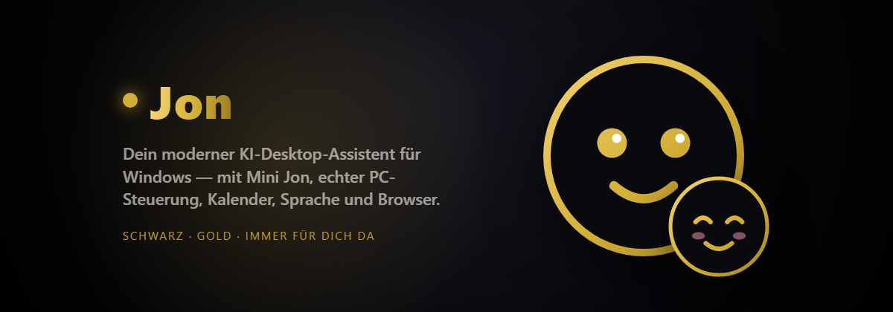
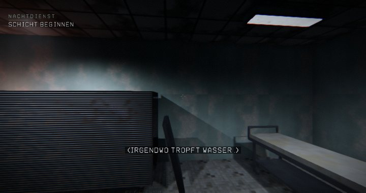
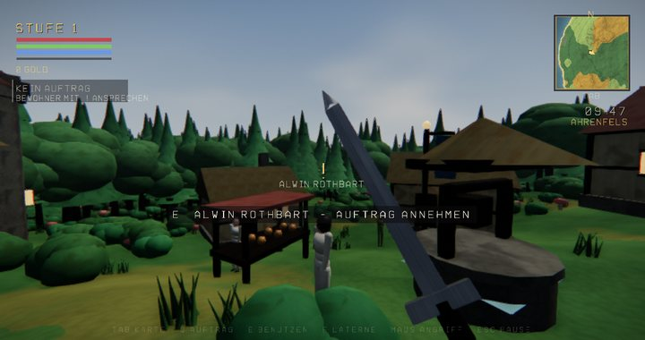
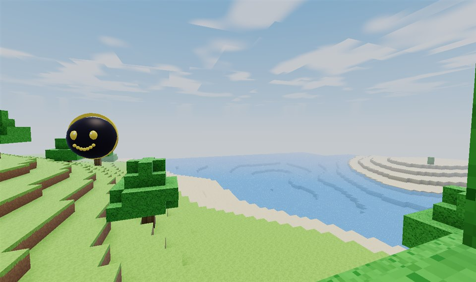
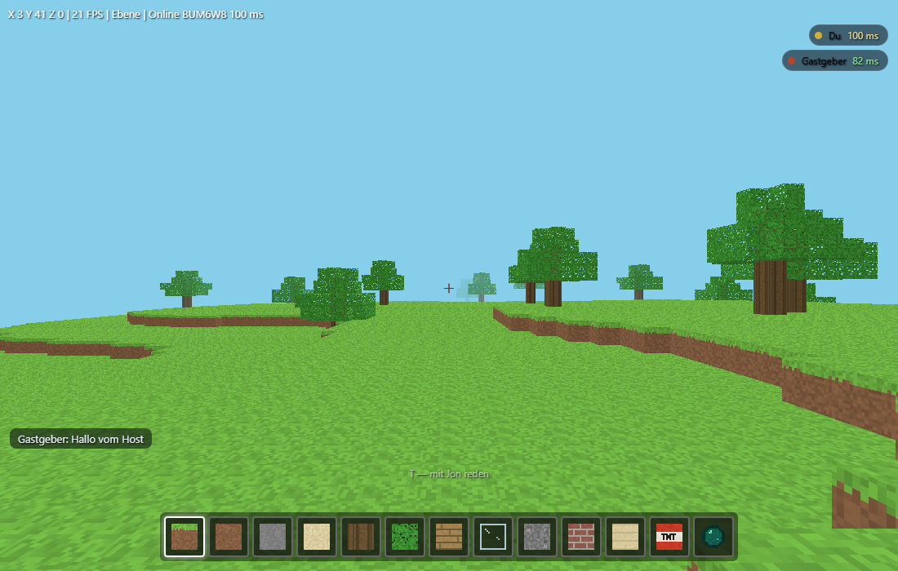

<div align="center">



# Jon — KI-Desktop-Assistent

**Ein Assistent, der nicht nur redet, sondern deinen PC wirklich bedient.**

[](CHANGELOG.md)
[](https://getjon.info)
[](LICENSE)
[](https://getjon.info)

[](https://github.com/Lightning702/Jon---AI/releases/latest/download/Jon-Setup.exe)
[](https://github.com/Lightning702/Jon---AI/releases/latest/download/Jon-Windows.zip)
[](https://getjon.info)

🇬🇧 [English version](README.en.md) · 📖 [Changelog](CHANGELOG.md) · 🕹️ [Spiele](#spiele--online-koop) · 🛠️ [Setup](#setup)

</div>

---

Jon ist ein moderner KI-Desktop-Assistent für Windows mit Multi-Provider-Unterstützung,
Streaming, Langzeit-Persistenz, echter Systemsteuerung, Maus-/Tastatur-Automatisierung,
Sprachsteuerung, einem bearbeitbaren Skill-System und einer eigenständigen Handy-App.
Backend in Python/FastAPI, Frontend in Electron + React + TypeScript im
Black/Gold-Glassmorphism-Design. (Claude hat es nur veröffentlicht, weil ich nicht wusste
wie das geht. Er hat auch bisschen geholfen.)

<div align="center">

### 🎬 Jon in zwei Minuten installieren

[](https://www.youtube.com/watch?v=tjVsXAmi750)

*Klick aufs Bild — das Video liegt auch auf [getjon.info](https://getjon.info).*

</div>

---

## 🕹️ Fünf Spiele. Zwei Spieler. Ein Freundschaftscode.

Die **FelWorks Game Collection** steckt direkt in Jon — und seit v3.34 spielt ihr alles
zu zweit über einen 6-stelligen Code.

<table>
<tr>
<td width="50%" align="center">

<br><b>ECHO</b><br><sub>Psychological Horror · 4 Etagen · 464 Räume · fünf Enden</sub>
</td>
<td width="50%" align="center">

<br><b>AETHERIA</b><br><sub>Fantasy-Open-World · Dörfer, Aufträge, Weltkarte</sub>
</td>
</tr>
<tr>
<td width="50%" align="center">

<br><b>Blockwelt</b><br><sub>Endlose Voxel-Welt, in der Mini Jon für dich baut</sub>
</td>
<td width="50%" align="center">

<br><b>Online-Koop</b><br><sub>Gemeinsame Welt, Ping-Anzeige, Team-Chat</sub>
</td>
</tr>
</table>

---

## Inhalt

| Loslegen | Können | Technik |
| --- | --- | --- |
| [⬇ Jon herunterladen](#jon-herunterladen) | [✨ Funktionen](#funktionen) | [🛠️ Setup](#setup) |
| [🚀 Installation mit der .exe](#weg-a--installation-mit-jon-setupexe) | [🔧 Tools](#was-jon-steuern-kann-tools) | [💻 Aus dem Quellcode](#weg-b--aus-dem-quellcode) |
| [🔑 Konten & Modelle](#konten--modelle) | [🧩 Skills](#skills) | [📚 Dokumentation](#dokumentation) |
| [📱 Handy-App](#handy-app) | [🕹️ Spiele & Online-Koop](#spiele--online-koop) | [🔒 Sicherheit](#sicherheit) |
| [🔗 Verbindungen](#verbindungen-einrichten) | [💬 Freunde-Chat](#freunde-chat-) | [💾 Backup & Updates](#backup--updates) |

---

## Jon herunterladen

Der einfachste Weg: die fertigen Downloads von der Website
**[https://getjon.info](https://getjon.info)** (oder direkt aus den
[GitHub-Releases](https://github.com/Lightning702/Jon---AI/releases/latest)):

- **Jon-Setup.exe** — Installer mit Startmenü- und Desktop-Verknüpfung
- **Jon-Windows.zip** — portable Version: entpacken, `Jon.exe` starten

Beide enthalten die Jon App, Mini Jon und das komplette Backend (startet automatisch
mit). API-Einstellungen trägst du direkt in der App ein (Zahnrad → **Konten**) — kein
Python, kein Node.js, keine `.env` nötig.

Für Entwickler gibt es weiter den Quellcode als `jon.zip` auf der Website:

1. Entpacke die Zip-Datei an einen Ort deiner Wahl (z. B. `C:\Jon`)
2. Folge danach der [Setup-Anleitung](#setup) weiter unten
3. Nach dem Setup startet ein Doppelklick auf `start-jon.bat` Backend und App zusammen

Alternativ das Repository direkt klonen:

```bash
git clone https://github.com/Lightning702/Jon---AI.git
```

**Voraussetzungen:** Windows 10/11, [Python](https://www.python.org/downloads/) 3.12 oder
neuer und [Node.js](https://nodejs.org/) 20 oder neuer.

**Ohne Installation:** Die Handy-App läuft direkt im Browser unter
[https://getjon.info/app](https://getjon.info/app/).

---

## Funktionen

- **🙂 Mini Jon (Jon Jr)** — Jons kleiner Sohn lebt als niedlicher, minimalistischer Kreis
  direkt auf deinem Desktop: immer im Vordergrund, verschiebbar, beim Windows-Start schon da.
  Er begrüßt dich mit Updates, **hört durchgehend zu** (sag einmal „Jon", dann redest du
  einfach weiter), **spricht mit lippensynchronem Mund**, und **kann alles, was der große Jon
  kann** (Web-Suche, Dateien, PC-Steuerung …). Sein Gesicht, seine Farben, Augen, Größe und
  sein Haustier sind frei anpassbar (🎨-Knopf); im hellen Modus wird auch er weiß, im
  Cozy-Modus rosa. Er hat — wie der große Jon — seine eigene Persönlichkeit und
  Familiengeschichte. Ein-/Ausblenden mit `Strg+Alt+K`
- **🕹️ Spiele (FelWorks Game Collection)** — **ECHO** (First-Person-Psychological-Horror,
  4 Etagen, 464 Räume, fünf Enden), **AETHERIA** (Fantasy-Open-World-RPG mit Dörfern,
  Aufträgen und Weltkarte), **STARFALL** (Echtzeit-Simulation eines rotierenden Schwarzen
  Lochs), die **Harmonischen Inseln** (ruhiges Aufbauspiel auf einem schwebenden Archipel)
  und die **Blockwelt** (Voxel-Sandbox ohne Weltrand, in der Mini Jon für dich baut) stecken direkt in
  Jon: **Werkzeuge → Spiele → Starten** oder `/spiele`. Nichts startet von allein — erst
  der Klick öffnet das Spiel, jedes in einem eigenen Fenster. Jon läuft dabei normal
  weiter. Weitere Spiele kommen dazu, indem man einen Ordner mit einer `jon-spiele.json`
  neben Jon legt
- **Persönlichkeit & eigenes Gedächtnis** — Jon ist kein neutraler Bot: eigener Charakter,
  Stimmungen, Lebensgeschichte und eine eigene `MEMORY.md`, in die er selbst schreibt
- **KI-Team, Simulationen, Zeitreise & Dream Mode** — `/team`, `/simulate`, `/snapshot(s)`,
  `/dream(s)` (siehe Befehle-Tab im Nutzer-Menü)
- **📚 Wissensbasis (RAG)** — „Jon, lern dieses PDF/diesen Ordner": lokale, durchsuchbare
  Wissensbasis (komplett offline), aus der Jon beim Antworten zitiert
- **🌅 Tagesbriefing** — täglich beim ersten Start und per `/briefing`: Wetter (Stadt im
  Zahnrad-Menü), Erinnerungen, Wecker und geplante Automationen
- **⚡ Schnellfrage-Overlay** — `Strg+Alt+Leertaste` öffnet überall ein kleines
  Spotlight-Fenster: Frage tippen, Antwort erscheint sofort, `Esc` schließt
- **📋 Clipboard-Historie** — die letzten 50 kopierten Einträge, lokal gespeichert,
  durchsuchbar über den 📋-Knopf oder `/clipboard`, mit einem Klick wieder kopiert
- **🤖 Echte Automationen** — „Räum jeden Tag um 18 Uhr meinen Downloads-Ordner auf":
  Jon führt geplante Aufgaben zur Uhrzeit wirklich aus und berichtet (`/tasks`)
- **📎 Datei-Anhänge im Chat** — PDFs, Bilder und Textdateien per Drag & Drop oder
  Büroklammer: PDFs werden gelesen, Bilder vom Vision-Modell beschrieben
- **🎁 Zeitkapseln** — Nachrichten an dein zukünftiges Ich: Jon versiegelt sie mit seiner
  aktuellen Stimmung und übergibt sie feierlich am Zieltag
- **📷 Webcam-Blick** — „Jon, was siehst du über meine Webcam?": Jon macht ein Webcam-Foto
  und antwortet garantiert mit einer Beschreibung — ausschließlich auf deine Bitte und nur,
  wenn du im Zahnrad-Menü „Webcam erlauben" aktiviert hast (Standard: aus)
- **💬 Immer im Gespräch** — Jon und Mini Jon beenden jede Antwort mit einer kurzen
  Rückfrage oder einem nächsten Vorschlag (abschaltbar: einfach sagen)
- **📧 E-Mail & Kalender** — IMAP-Postfach und ICS-Kalender: ungelesene Mails im
  Tagesbriefing, Mails vorlesen und beantworten, Termine abfragen
- **📲 Telegram-Fernbedienung** — Schreib Jon von unterwegs: Er steuert deinen PC und
  antwortet aufs Handy — weltweit, ohne VPN, gratis
- **👀 Datei-Wächter** — „Sortiere neue Downloads automatisch": Jon reagiert, sobald neue
  Dateien in einem Ordner auftauchen
- **🎵 Medien-Steuerung** — „leiser", „nächster Song", „Pause" über die Windows-Medientasten
  (funktioniert mit Spotify, YouTube, allem)
- **🗣️ Natürliche Stimme** — echte Neural-Stimme statt Roboterstimme (gratis), optional
  Offline-Spracherkennung mit Whisper
- **📊 Wochenrückblick** — jeden Sonntag ein persönlicher Rückblick von Jon (`/woche`)
- **🩺 PC-Gesundheitscheck** — `/check`: Speicherplatz, RAM-Fresser, Autostart, Temp-Müll —
  mit Aufräum-Vorschlägen, die Jon direkt umsetzt
- **🏠 Smart Home** — Home Assistant: „Jon, mach das Licht aus"
- **🌐 Netzwerk & Drucker** — Geräte im WLAN finden, per Wake-on-LAN aufwecken, Dateien
  ausdrucken („Druck mir das aus")
- **👤 Profil** — beim ersten Start fragt Jon nach deinem Namen und spricht dich fortan
  damit an; jederzeit änderbar
- **💬 Freunde-Chat (Peer-to-Peer)** — Nachrichten, Bilder, Videos, **Sprachnachrichten**
  (auf Wunsch als Text statt zum Anhören) und **Gruppen**. Direkt von PC zu PC, **Ende-zu-Ende
  verschlüsselt**, ohne Cloud und ohne Kosten. Unbekannte müssen erst eine
  **Freundschaftsanfrage** stellen. Über das Relay erreichst du auch Freunde im Internet —
  und Jon schreibt auf Zuruf für dich („Sag Anna, dass ich später komme")
- **Coding-Agent** — als **„Jon Code"-Modus in der App** (Button oben rechts: Dateibaum +
  Editor + Jon-Agent rechts, mit `/model`- und `/provider`-Wechsel) und als **`jon`-Befehl
  im VS-Code-Terminal**. Jon arbeitet an ganzen Projekten wie ein moderner KI-Coding-Agent
  und bleibt dabei technisch auf den gewählten Projektordner begrenzt — Zugriffe außerhalb
  und Sprünge per `cd` werden blockiert. Nennst du eine Datei („schreib mir in index.html
  ein Login-Formular"), landet der Code direkt dort; ohne Dateinamen gilt die geöffnete
  Datei. Oberflächen baut Jon von selbst modern (Liquid Glass) statt grau
  (siehe [docs/CLI.md](docs/CLI.md))
- **📊 Präsentationen** — „Mach mir eine Präsentation über den Klimawandel": Jon baut eine
  fertige **.pptx** mit Titelfolie, Karten, Kennzahlen, Zeitstrahl, Zitaten und
  Sprechernotizen in elf Farbwelten und öffnet sie
- **Multi-Provider-Chat** mit einheitlicher Schnittstelle: NVIDIA, OpenAI, Anthropic,
  Gemini, **Ollama & LM Studio (lokal, gratis)**, OpenRouter, Groq, Together AI, xAI,
  DeepSeek, GLM, Qwen, Mistral
- **🦙 Ollama komplett eingebaut** — eigener Einstellungsbereich mit Serverstatus,
  Verbindungstest, Modellverwaltung und allen Reglern (Temperatur, Top P, Top K, Max
  Tokens, Context Length, Keep Alive, Seed, System Prompt, Streaming, Timeout). Der Server
  darf auf deinem PC, auf einem zweiten Rechner im Heimnetz oder über Tailscale laufen —
  ganz ohne API-Schlüssel (siehe [docs/OLLAMA.md](docs/OLLAMA.md))
- **🧊 Echte 3D-Modelle für Mini Jon** — ein Schalter in **Mini Jon anpassen**, und Mini
  Jon, Katze und Hund werden zu richtigen 3D-Modellen: eigener WebGL-Renderer ohne
  Fremdbibliothek, echte Geometrie mit Licht, Glanzlicht und Tiefe, sprechender Mund,
  Blinzeln und sichtbares Einschlafen — inklusive Live-Vorschau im Dialog
- **🤝 Ollama-Server freigeben** — gib deinen Server per Freigabecode oder Einladungslink
  für andere Jon-Nutzer frei (privat, nur Eingeladene oder öffentlich). Bei ihnen taucht er
  automatisch in der KI-Auswahl auf; du siehst jederzeit, wer verbunden ist, welches Modell
  läuft und wann er zuletzt aktiv war — und entziehst den Zugriff mit einem Klick
- **Erinnerungen/Loops**: „Erinnere mich jeden Tag um 13 Uhr ans Trinken" — Jon meldet sich,
  sobald die App offen ist, mit Chat-Nachricht und Browser-Benachrichtigung
- **Eigenes Prompt & eigene Skills** direkt in der App (Konten → Prompt / Skills)
- **Echtes Token-Streaming** (Server-Sent Events), inklusive separatem Denkprozess
  (`reasoning_content`)
- **Modell- und Providerwechsel** zur Laufzeit; automatische Modell-Erkennung pro Anbieter
- **Großes Antwortlimit** (bis 32.768 Tokens) mit automatischer Anpassung an Modellgrenzen
- **Echtes Tool-/Function-Calling** — Jon steuert den PC wirklich (siehe unten)
- **Freigabe-Modus**: „Zuerst fragen" (Standard) oder „Alles erlauben", dauerhaft gespeichert
- **Aufklappbare Tool-Anzeige**: jede Aktion zeigt auf Klick den genauen Befehl und eine
  kurze Erklärung
- **Maus-/Tastatur-Automatisierung** über PyAutoGUI (Multi-Monitor)
- **Sprachsteuerung** mit Wake-Word „Jon" und Text-to-Speech-Antworten
- **Langzeitgedächtnis**: Jon merkt sich Fakten über alle Unterhaltungen hinweg
- **Skill-System**: bearbeitbare Markdown-Anleitungen (z. B. Web-Design)
- **Konten-Bereich**: Provider offiziell per API-Key verbinden, Modelle wählen
- **Nutzungs-Übersicht** `/usage`: real gemessene Tokens, Anfragen, Antwortzeiten
- **Handy-App (PWA)**: Chat, Apps öffnen, Teilen, Vorlesen, Spracheingabe, Bildanalyse
- **Website & Netlify-Deployment** inklusive Handy-Proxy für NVIDIA

---

## Was Jon steuern kann (Tools)

Jon ruft echte Funktionen auf dem PC auf. Jede Aktion ist im Chat als Chip sichtbar und
auf Klick aufklappbar (Befehl + Erklärung + Ergebnis).

| Bereich | Tools |
|---------|-------|
| Shell | `run_powershell`, `run_cmd` |
| Programme | `start_program`, `kill_program`, `open_url`, `open_in_vscode` |
| Dateien | `list_dir`, `read_file`, `write_file`, `append_file`, `move_path`, `copy_path`, `delete_path`, `make_dir`, `search_files` |
| Archive | `zip_paths`, `unzip` |
| System | `system_info`, `list_processes`, `lock_screen`, `open_explorer` |
| Zwischenablage | `clipboard_get`, `clipboard_set`, `clipboard_history` |
| E-Mail & Kalender | `check_mail`, `read_mail`, `send_mail`, `get_calendar` |
| Musik & Medien | `media_control`, `spotify_play`, `spotify_search`, `spotify_now_playing`, `amazon_play`, `amazon_now_playing` |
| Datei-Wächter | `add_watcher`, `list_watchers`, `delete_watcher` |
| Smart Home | `smarthome_devices`, `smarthome_control` |
| Netzwerk & Drucker | `scan_network`, `wake_device`, `list_printers`, `print_file` |
| Wissensbasis | `learn_document`, `ask_knowledge`, `list_documents`, `forget_document` |
| Automationen | `add_task`, `list_tasks`, `delete_task` |
| Zeitkapseln | `time_capsule`, `list_capsules` |
| Bildschirm | `screenshot`, `get_screen_info` |
| Webcam | `webcam_look` |
| Web | `http_get`, `download_file` |
| Maus/Tastatur | `mouse_move`, `mouse_click`, `mouse_scroll`, `keyboard_type`, `keyboard_press`, `keyboard_hotkey` |
| Fenster | `list_windows`, `focus_window`, `wait` |
| Gedächtnis | `remember`, `recall`, `forget` |
| Skills | `list_skills`, `read_skill`, `write_skill` |

Standardmäßig fragt Jon vor jeder Aktion um Erlaubnis. Reine Abfragen (Systeminfo, Fenster
auflisten, Skill lesen, Erinnerung abrufen) laufen ohne Rückfrage. Der Modus ist im
Zahnrad-Menü umstellbar. Alle Tools sind in [docs/API.md](docs/API.md) dokumentiert.

---

## Skills

Skills sind **bearbeitbare Markdown-Anleitungen** im Ordner `skills/`. Jon liest die
passende Anleitung, bevor er eine Aufgabe startet, und folgt ihr. Du kannst sie in der App
(Konten → Skills), in jedem Texteditor oder direkt in der entpackten ZIP bearbeiten.

Mitgeliefert:

- **web-design** — wie Jon moderne, responsive Websites baut
- **pc-automation** — zuverlässige Maus-/Tastatur-Steuerung
- **research** — sauberes Nachschlagen und Zusammenfassen

Mehr dazu in [docs/SKILLS.md](docs/SKILLS.md).

---

## 🦙 Ollama — Jon ganz ohne Cloud

Mit [Ollama](https://ollama.com) antwortet Jon komplett auf deiner eigenen Hardware:
kostenlos, privat, ohne API-Schlüssel und ohne Internet. Der Ollama-Server darf dabei auf
demselben PC laufen, auf einem zweiten Rechner im Heimnetz oder über **Tailscale** auf
einer Maschine ganz woanders. Jon spricht dabei die **offizielle Ollama-API**.

**In drei Schritten:**

1. [Ollama installieren](https://ollama.com/download) und ein Modell laden:

   ```bash
   ollama pull llama3.2
   ```

2. In Jon: **Zahnrad-Menü → Ollama → Ollama verwenden** einschalten.
3. **Server & Modelle …** öffnen, **Verbindung testen** drücken, Modell auswählen,
   **Speichern**. Oben im Chat als Anbieter `ollama` wählen — fertig.

**Der Ollama-Bereich zeigt und kann:**

| | |
|---|---|
| **Serverstatus** | Online / Offline / Verbinde … , Antwortzeit, Ollama-Version, gewähltes Modell, Anzahl installierter Modelle, letzte erfolgreiche Verbindung |
| **Server** | Server-URL, Host/IP, Port, http oder https — mit Vorschlägen für localhost, Heimnetz und Tailscale zum Anklicken |
| **Modelle** | automatisch laden, neu laden, auswählen |
| **Antwortverhalten** | Temperatur, Top P, Top K, Max Tokens, Context Length, Keep Alive, Seed |
| **Weiteres** | System Prompt, Streaming an/aus, Timeout, automatische Wiederverbindung |

Alles wird dauerhaft in `data/ollama.json` gespeichert und beim Start automatisch geladen.

**Ollama auf einem anderen Gerät:** Auf dem Ollama-Rechner `OLLAMA_HOST=0.0.0.0` setzen,
Port 11434 in der Firewall freigeben und in Jon Host und Port eintragen — zum Beispiel
`192.168.1.50:11434` im Heimnetz oder `100.x.x.x:11434` über Tailscale.

**Wenn etwas klemmt:** Jon zeigt statt eines Absturzes eine klare Meldung — „Keine
Verbindung zu Ollama unter …", „Das Modell X ist auf dem Server nicht installiert
(ollama pull X)" oder „Ollama hat zu lange gebraucht". Nach der Korrektur genügt
**Verbindung testen**. Kann ein Modell keine Werkzeuge, wiederholt Jon die Anfrage
automatisch ohne Werkzeuge, statt abzubrechen.

### 🤝 Deinen Server für Freunde freigeben

Hast du die stärkere Grafikkarte, können andere Jon-Nutzer über deinen Ollama-Server
chatten — ohne selbst etwas zu installieren.

- **Freigeben:** Im Ollama-Fenster unter **Serverfreigabe** einschalten, Namen und
  Beschreibung eintragen, Sichtbarkeit wählen (**Privat**, **Nur Eingeladene** oder
  **Öffentlich**) und den **Freigabecode** oder **Einladungslink** weitergeben.
- **Verbinden:** Der andere trägt Code oder Link unter **Freigegebene Server nutzen** ein —
  am schnellsten über den Knopf **🤝 Ollama teilen** oben im Chat. Danach steht bei ihm in
  der Anbieterauswahl zusätzlich **„Ollama von <dein Name>"**; wählt er sie, ist dein
  geteiltes Modell fest eingestellt und nicht änderbar. Chat, Verlauf, Streaming und alle
  Ollama-Einstellungen funktionieren ganz normal.
- **Verwalten:** Du siehst jeden verbundenen Benutzer mit Status, genutztem Modell,
  Sitzungen, Anfragen und letzter Aktivität — und wirfst ihn mit einem Klick wieder
  hinaus. **Allen Zugriff entziehen** wirkt sofort, auch mitten in einer Antwort.
- **Sicher:** Jeder Gast bekommt ein eigenes Zugriffstoken (nur als Hash gespeichert);
  ohne gültiges Token geht gar nichts. Freigegeben ist ausschließlich das Antworten des
  Modells — deine Chats, Dateien und die PC-Steuerung bleiben unerreichbar, denn die
  Freigabe hängt am Chat-Port 8758 und nicht an Jons Steuer-API.

Die komplette Anleitung mit LAN, Tailscale, Serverfreigabe, Modellempfehlungen,
Sicherheitshinweisen, Fehlerbehebung und FAQ steht in
**[docs/OLLAMA.md](docs/OLLAMA.md)**.

---

## Verbindungen einrichten

Alle Verbindungen sind **kostenlos** — du zahlst nur für deine LLM-API (oder gar nichts,
wenn du Ollama nutzt). Öffne dazu **Zahnrad-Menü → 🔌 Verbindungen**. Alles wird nur lokal
auf deinem PC gespeichert.

| Verbindung | Was du brauchst | Wo du es herbekommst |
|---|---|---|
| 📧 **E-Mail** | IMAP-Server, Adresse, App-Passwort | Gmail: `imap.gmail.com` + [App-Passwort](https://myaccount.google.com/apppasswords) (nicht dein normales Passwort!). GMX/Web.de: IMAP zuerst in den Konto-Einstellungen freischalten |
| 📅 **Kalender** | ICS-URL | Google Kalender → Einstellungen → *Geheime Adresse im iCal-Format*. Geht auch mit Outlook, Apple, Nextcloud |
| 📲 **Telegram** | Bot-Token | In Telegram `@BotFather` anschreiben → `/newbot` → Namen wählen → Token kopieren. Danach **deinem eigenen Bot** `/start` schreiben — der erste Chat wird automatisch mit deinem PC verknüpft, alle anderen werden abgewiesen. Telegram nutzt ein eigenes, schnelles Modell (`openai/gpt-oss-20b`), damit du unterwegs nicht wartest — App und Mini Jon behalten dein gewähltes Modell |
| 🎧 **Spotify** | Client-ID + Secret | [developer.spotify.com/dashboard](https://developer.spotify.com/dashboard) → *Create app* → beliebiger Name, Redirect-URI `http://localhost` → ID und Secret kopieren. **Kein Premium nötig** |
| 🏠 **Smart Home** | Home-Assistant-URL + Token | Home Assistant → Profil (unten links) → Sicherheit → *Langlebiges Zugriffstoken* |

**So benutzt du sie:**

- **Mails:** „Hab ich neue Mails?" · „Lies mir die von Anna vor" · „Antworte ihr, dass ich
  morgen Zeit habe" — ungelesene Mails und heutige Termine stehen automatisch im
  Tagesbriefing
- **Telegram:** Schreib deinem Bot von unterwegs „Öffne YouTube auf meinem PC", „Fahr den
  PC in 10 Minuten runter" oder „Was steht heute an?" — Jon führt es aus und antwortet dir.
  Er darf dabei alle Tools ohne Rückfrage nutzen (du bist ja nicht am PC), zeigt jede
  Aktion sofort als ⚙️-Meldung an und tippt sichtbar, während er arbeitet. `/reset` löscht
  den Gesprächsverlauf
- **Datei-Wächter:** „Überwach meinen Downloads-Ordner und sortiere neue Dateien nach Typ
  in Unterordner" — Jon prüft alle 12 Sekunden und meldet sich im Chat, wenn er was getan hat
- **Medien:** „Mach leiser" · „Nächster Song" · „Pause" — funktioniert mit Spotify, YouTube
  und allem anderen, weil Jon die echten Windows-Medientasten drückt
- **Spotify:** „Spiel Musik von Spotify" · „Spiel Bohemian Rhapsody von Spotify" · „Spiel
  was Entspanntes" · „Was läuft gerade?" — Jon sucht den Song und startet ihn in deiner
  Spotify-App. Ist die App nicht installiert, öffnet er den Web Player und drückt Play.
  Funktioniert auch mit einem **kostenlosen Spotify-Konto** (mit Werbung, wie üblich)
- **Amazon Music:** „Spiel XY auf Amazon Music" — Jon öffnet die Suche im Amazon-Music-
  Player und drückt Play. Amazon bietet (anders als Spotify) **keine offene Wiedergabe-
  Schnittstelle** an, deshalb muss dort eventuell einmal auf den ersten Treffer geklickt
  werden; danach steuert Jon Pause/Weiter/Lautstärke wieder selbst. Für vollautomatisches
  Abspielen ist Spotify der zuverlässigere Weg
- **Smart Home:** „Welche Geräte hast du?" · „Mach das Wohnzimmerlicht aus" · „Stell die
  Heizung auf 21 Grad"
- **Netzwerk & Drucker:** „Welche Geräte sind in meinem WLAN?" · „Weck meinen anderen PC
  auf" (Wake-on-LAN) · „Druck mir den Lebenslauf aus"
- **PC-Check:** `/check` — Jon analysiert Speicherplatz, RAM-Fresser, Autostart-Programme
  und Temp-Müll und schlägt konkrete Aufräum-Aktionen vor, die er direkt ausführen kann
- **Wochenrückblick:** `/woche` — oder automatisch jeden Sonntag beim ersten Start

---

## Freunde-Chat (💬)

Jon-Nutzer können sich **direkt gegenseitig schreiben** — Text, Bilder, Videos und Dateien
(bis 60 MB). Ohne Server, ohne Konto, ohne Kosten.

**So funktioniert es:**

1. Beim ersten Start legst du deinen **Namen** fest (später über 💬 → Profil änderbar).
   Jeden Namen gibt es im Netzwerk **nur einmal**
2. Klick auf **💬** in der Kopfzeile
3. Freund hinzufügen:
   - **Im selben WLAN:** einfach seinen **Namen** eintippen — Jon findet ihn
   - **Woanders (Internet):** er trägt deinen **Jon-Code** ein (steht oben links im Chat).
     Dafür muss das **Relay** an sein (Zahnrad → 🔌 Verbindungen), kostenlos
4. Dein Freund bekommt eine **Freundschaftsanfrage** und muss sie annehmen. Erst danach
   könnt ihr schreiben
5. Mit 📎 sendest du Bilder, Videos und Dateien, mit 🎙 eine **Sprachnachricht**. Wer nicht
   zuhören will, klickt **„📝 Text anzeigen"** und liest sie stattdessen
6. Über **👥 Gruppe erstellen** chattest du mit mehreren Freunden. Die Eingeladenen müssen
   **beitreten** — und das geht nur, wenn sie mit mindestens einer Person aus der Gruppe
   befreundet sind. Verlassen kann die Gruppe jeder jederzeit

**Was der Chat sonst noch kann:**

- **⏳ Offline-Zustellung** — ist dein Freund gerade aus, wartet die Nachricht und wird
  zugestellt, sobald er wieder online ist
- **✓✓ Zustell- und Lesebestätigung** — 🕑 wartet · ✓✓ zugestellt · blaues ✓✓ gelesen
- **🗑 Löschen & Zurückrufen** — bei dir oder **für alle** (dann verschwindet sie auch beim
  Freund), und der ganze **Verlauf** auf einen Klick
- **↩ Antworten & @Erwähnungen** — auf eine bestimmte Nachricht antworten, in Gruppen mit
  `@Name` jemanden direkt ansprechen
- **❤️ Reaktionen** und **🔍 Suche** über alle Chats (auch in Sprachnachrichten)

Wie bei WhatsApp siehst du eine **Tipp-Animation**, während dein Freund schreibt, und
bekommst eine **Windows-Benachrichtigung** mit Ton, wenn dir jemand schreibt.

**Jon schreibt auch für dich:** „Sag Anna, dass ich später komme" · „Was hat Anna
geschrieben?"

**Wo liegen die Daten?** Ausschließlich auf **euren Geräten**: Nachrichten in der lokalen
Datenbank, Medien im Ordner `p2p_media`. Löschst du einen Kontakt, verschwindet alles mit.

**Ist das sicher?**

- **Ende-zu-Ende verschlüsselt** (X25519 + AES-GCM). Die Schlüssel entstehen auf euren PCs
  und verlassen sie nie — auch das Internet-Relay sieht nur unlesbaren Datensalat
- **Niemand kann dir ungefragt schreiben:** Unbekannte landen in der Anfrage-Liste. Bis du
  annimmst, kommt keine Nachricht und keine Datei an. Blockieren geht mit einem Klick
- Der Chat läuft auf einem **eigenen, abgeschotteten Port (8758)**, der ausschließlich
  Nachrichten annimmt. Die Jon-API mit der PC-Steuerung bleibt nur lokal auf `127.0.0.1` —
  niemand im WLAN kann darüber deinen PC steuern
- Beim ersten Start fragt die Windows-Firewall nach Erlaubnis für den Chat-Port

---

## Backup & Updates

- **Backup** (Zahnrad-Menü): Gedächtnis, Wissensbasis, Skills und Einstellungen als ZIP
  exportieren und auf einem anderen PC wieder einspielen. API-Schlüssel bleiben absichtlich
  draußen
- **Updates:** Jon prüft beim Start, ob eine neuere Version auf GitHub liegt, und sagt
  Bescheid. `/update` (oder der Update-Knopf) erledigt den Rest:
  - **Hast du Jon mit `Jon-Setup.exe` installiert**, lädt Jon das neue
    Installationsprogramm mit Fortschrittsanzeige herunter, prüft es, fragt einmal nach,
    schließt sich und installiert. Danach startet Jon von selbst wieder — Chats, Konten
    und Einstellungen bleiben erhalten.
  - **Arbeitest du mit dem Quellcode**, macht Jon ein Backup von `data/`, ein `git pull`
    und installiert nur bei Bedarf `pip`/`npm` nach.
- **Jon beenden** (das X oder Tray → „Jon beenden") schließt auch das Backend. Soll Jon
  im Hintergrund bleiben, nimm den ⌄-Knopf daneben oder Tray → „Im Hintergrund
  weiterlaufen"; mit **Strg+Alt+J** holst du ihn zurück

---

## Konten & Modelle

Im Bereich **Konten** (Personen-Symbol oben rechts) verbindest du Anbieter über den
**offiziellen API-Key**. Jon erkennt danach automatisch alle verfügbaren Modelle und du
wählst dein Standardmodell.

> **Transparenz:** Ein Login mit einem ChatGPT-Plus- oder Claude-Pro-*Abo*, der die
> Abo-Tokens nutzt, wird von OpenAI und Anthropic offiziell **nicht** für Drittanbieter
> angeboten. Jon nutzt deshalb ausschließlich den offiziellen API-Zugang. Angaben wie
> Tarif oder Profilbild liefern die offiziellen APIs nicht — Jon zeigt dann ehrlich
> „Über die offizielle API nicht verfügbar" statt Daten zu erfinden. Die Architektur ist
> modular und für spätere offizielle Konto-Verknüpfungen vorbereitet.

---

## Nutzung /usage

Tippe **`/usage`** im Chat (oder öffne Konten → Nutzung). Jon zeigt real gemessene Werte
aus den offiziellen API-Antworten:

- Prompt-Tokens, Completion-Tokens, Gesamt-Tokens
- Anzahl der Anfragen, durchschnittliche Antwortzeit
- verwendetes Modell, Zeitpunkt der letzten Anfrage

Kosten, Rate-Limits und Restkontingent geben die meisten APIs nicht direkt aus — diese
Felder werden nicht erfunden.

---

## Handy-App

Die PWA unter [getjon.info/app](https://getjon.info/app/) läuft ohne
Installation und speichert deinen Key nur lokal! Sie kann:

- mit jedem Provider chatten (eigener API-Key)
- **Apps öffnen** (WhatsApp, YouTube, Maps, Spotify, Kamera … per offiziellen Deep-Links)
- über das **Teilen-Menü** teilen (Web Share API)
- Antworten **vorlesen** (Text-to-Speech) und per **Spracheingabe** zuhören
- **Bilder analysieren** (Foto anhängen → Vision-Modell)
- Standort und Uhrzeit abfragen

Android schränkt aus Sicherheitsgründen den Zugriff auf Kontakte, Nachrichten und fremde
Dateien im Browser ein. Jon nutzt dann die bestmögliche offizielle Alternative (z. B. die
App per Deep-Link öffnen) und sagt ehrlich, was nicht geht. Details in
[docs/ANDROID.md](docs/ANDROID.md).

### Handy = PC-App (1:1)

Wenn dein Handy im selben WLAN ist, kannst du die **komplette PC-App** am Handy nutzen —
mit allen Tools, Wissensbasis, Automationen und PC-Steuerung, weil dein PC die Arbeit macht:

1. In der `.env` auf dem PC `JON_LAN=1` setzen und Jon neu starten
2. Am Handy `http://<PC-IP>:8756/app` öffnen (PC-IP z. B. per `ipconfig`)

> ⚠️ Damit ist Jon für alle Geräte in deinem WLAN erreichbar — nur in vertrauenswürdigen
> Netzwerken aktivieren.

### Immer an: Jon auf dem Raspberry Pi

Damit Handy und Smartwatch Jon **rund um die Uhr** erreichen — auch wenn der PC aus ist —
kann das Backend auf einem Raspberry Pi (ab Pi 4) laufen:

1. Repo auf den Pi holen: `git clone https://github.com/Lightning702/Jon---AI.git jon`
   (oder die `jon.zip` von der Website entpacken)
2. `cd jon && bash pi-installieren.sh`
3. API-Keys eintragen: `nano .env`, danach `sudo systemctl restart jon`

Das Skript installiert alle Abhängigkeiten, baut die Web-App und richtet einen
systemd-Dienst ein, der **bei jedem Hochfahren automatisch startet** und bei Abstürzen neu
startet. Danach erreichst du Jon am Handy unter `http://<Pi-IP>:8756/app` — die Adresse
zeigt das Skript am Ende an.

Der PC-Betrieb ändert sich dadurch nicht: `start-jon.bat` funktioniert weiter wie gehabt.
PC und Pi sind zwei getrennte Jons mit eigenen Einstellungen und eigenem Gedächtnis. Auf
dem Pi fehlen nur die PC-Steuerungs-Tools (Fenster, Maus/Tastatur, Screenshots,
Zwischenablage) — alles andere (Chat, Web-Suche, Erinnerungen, Telegram, Freunde-Chat,
Wissensbasis …) läuft dort genauso.

---

## Spiele & Online-Koop

Jon bringt die **FelWorks Game Collection** mit (Werkzeuge → Spiele): **ECHO**
(Psychological Horror), **AETHERIA** (Open-World-RPG), **STARFALL** (Schwarzloch-Simulation),
die **Harmonischen Inseln** (cozy Aufbauspiel) und die **Blockwelt** (Voxel-Sandbox mit
endloser Welt).
Seit v3.33.0 haben ECHO, AETHERIA und die Blockwelt einen echten Online-Koop über einen
Freundschaftscode.

### So spielt ihr zusammen

1. Einer klickt **Spiel erstellen** — der Server legt eine Lobby an und nennt einen
   6-stelligen Code, z. B. `AB39KD`, plus eine **Einladung mit Adresse** wie
   `AB39KD@192.168.1.20:8760` für Spiele über das Internet.
2. Der andere klickt **Spiel beitreten** und tippt den Code ein. Seit v3.36.3 genügt der
   Code auch **von einem anderen Rechner im selben Netzwerk**: Jon fragt per
   UDP-Broadcast (Port 8761), wer die Lobby hat, und verbindet direkt dorthin —
   Laptop und PC finden sich also von allein. In der Blockwelt zeigt
   **Netzwerk durchsuchen** alle offenen Spiele im Heimnetz zum Anklicken.
3. Gast auf **Bereit**, Host auf **Starten** — beide spawnen gleichzeitig in dieselbe Welt.

In der Blockwelt: **O** öffnet die Lobby, **Z** ist der Team-Chat, **B** spielt ein Emote,
**Strg** duckt.

Der Server ist Jon selbst und läuft schon, sobald `start-jon.bat` oder `Jon.exe` gestartet
ist. Es braucht keinen extra Dienst.

| Was | Wo |
| --- | --- |
| Blockwelt (Browser) | WebSocket auf Port **8760** (`/api/mp/ws`), im Netzwerk erreichbar |
| ECHO & AETHERIA | TCP auf Port **8759**, im Netzwerk erreichbar |
| Lobby im Netzwerk finden | UDP **8761** (Broadcast-Suche nach Freundschaftscodes) |
| Blockwelt für Gäste ohne Jon | `http://<adresse>:8760/blockwelt` |
| Lobby-Status ansehen | `GET /api/mp/status`, `GET /api/mp/lobby/<CODE>` |
| Code im Netzwerk suchen | `GET /api/mp/find/<CODE>`, alle offenen Spiele: `GET /api/mp/scan` |
| Netzwerk-Diagnose | `GET /api/mp/network` (Adressen, Ports, Firewall-Status) |

### Heimnetz und Internet

Jon hört für den Koop auf **eigenen Ports (8760, 8759 und UDP 8761)**, die im Netzwerk
erreichbar sind — der Rest von Jon (Chat, Dateien, PC-Steuerung auf 8756) bleibt weiter
nur auf deinem Rechner. `JON_LAN` brauchst du dafür **nicht**.

- **Heimnetz**: nur den Code weitergeben. Kennt das Jon des Gastes den Code nicht, sucht
  es den Gastgeber im Netzwerk und schickt den Spieler mit einer `redirect`-Antwort
  direkt dorthin — im Browser wie in ECHO und AETHERIA.
- **Windows-Firewall**: blockt sie die Koop-Ports, steht in der Lobby ein Hinweis mit
  dem Knopf **Netzwerk freigeben** (`POST /api/mp/firewall`). Der legt nach einer
  Windows-Rückfrage die zwei Regeln „Jon Koop" an — nur für diese drei Ports.
- **Übers Internet**: Portfreigabe für 8760 (Browser) und 8759 (ECHO/AETHERIA) auf dem
  Rechner des Gastgebers — oder ein öffentlich erreichbarer Jon-Server, dann reicht der
  Code allein.
- Im Beitreten-Feld sind beide Formen erlaubt: `AB39KD` und `AB39KD@meinserver.de:8760`
  (in ECHO/AETHERIA `AB39KD@meinserver.de:8759`).
- Die Einladung nennt die **echte LAN-Adresse**: Jon liest die Netzwerkkarten über
  `GetAdaptersAddresses` aus und sortiert VPN-, Hyper-V-, VirtualBox- und WSL-Adapter
  nach hinten, statt einfach die erste Adresse des Rechnernamens zu nehmen.

### Technik in Kurzform

- **Serverautoritativ**: Positionen, Blöcke, Türen, Hebel, Rätsel, Items, NPCs, Quests
  und Checkpoints werden serverseitig geprüft. Unmögliche Bewegung wird korrigiert,
  Items lassen sich nicht erfinden, Ratenbegrenzung pro Spieler.
- **20-Hz-Snapshots mit Delta-Kompression** — nur Änderungen gehen über die Leitung,
  gegen den letzten bestätigten Snapshot des jeweiligen Clients.
- **Interpolation (110 ms Puffer), Extrapolation bis 280 ms, Client-Prediction** für den
  eigenen Charakter und Lag-Kompensation über einen Positionsverlauf pro Spieler.
- **Heartbeat, Ping, Paketverlust, automatischer Reconnect** — die Sitzung bleibt 150 s
  reserviert und wird auf Platte gesichert, übersteht also auch einen Backend-Neustart.

### Neu in ECHO

- **Jumpscares mit eigenen Modellen**: In jedem Flur wartet genau ein Schreck — sechs
  Varianten (aus der Tiefe rennend, im Rücken, aus der Seitentür, von der Decke, über
  den Boden kriechend, an der Wandkante lauernd), vier Kreatur-Archetypen, dazu Licht
  aus, Taschenlampen-Ausfall, Kamerawackler und fünf neue, laute Klänge.
- **`H` blendet den direkten Weg ein** — Markerkette durch die Türen zum Kampagnenziel,
  sonst zum nächsten Aufzug oder Treppenhaus, mit Restdistanz. Nochmal `H` schließt ihn.
- Diagnose für den Koop: `ECHO/bin/ECHO.exe -nettest 127.0.0.1:8759` schreibt das
  Ergebnis nach `ECHO/echo.log`.


---

## Setup

Es gibt zwei Wege. **Fast alle wollen Weg A** — da brauchst du weder Python noch Node.js
noch eine `.env`.

| | Weg A: Jon-Setup.exe | Weg B: Quellcode |
| --- | --- | --- |
| Für wen | einfach benutzen | mitentwickeln, Pi, Linux |
| Vorbereitung | keine | Python 3.12+, Node.js 20+ |
| API-Keys | in der App unter **Konten** | in der App oder in der `.env` |
| Updates | Knopf in der App | `/update` (`git pull`) |
| Dauer | ~2 Minuten | ~10 Minuten |

---

### Weg A — Installation mit `Jon-Setup.exe`

**1. Herunterladen**

[⬇ Jon-Setup.exe](https://github.com/Lightning702/Jon---AI/releases/latest/download/Jon-Setup.exe)
(~280 MB) oder über [getjon.info](https://getjon.info). Wer nichts installieren will,
nimmt [Jon-Windows.zip](https://github.com/Lightning702/Jon---AI/releases/latest/download/Jon-Windows.zip):
entpacken, `Jon.exe` starten, fertig — Schritt 2 und 3 entfallen dann.

**2. Windows-Warnung wegklicken**

Beim ersten Start meldet sich SmartScreen mit *„Der Computer wurde durch Windows
geschützt"*. Das liegt **nicht** an einem Virus, sondern daran, dass die Datei nicht mit
einem kostenpflichtigen Zertifikat signiert ist. Klicke auf **Weitere Informationen** →
**Trotzdem ausführen**. Der komplette Quellcode liegt hier im Repo, du kannst Jon
jederzeit selbst bauen.

**3. Installieren**

Der Installer fragt nach dem Zielordner (Vorgabe passt), legt Startmenü- und
Desktop-Verknüpfung an und startet Jon danach automatisch. Installiert wird **für den
aktuellen Benutzer**, also ohne Administratorrechte.

Mit dabei sind: die Jon-App, **Mini Jon** (die Desktop-Figur), das komplette **Backend**
(startet automatisch mit) und die **FelWorks Game Collection**. Nichts davon musst du
separat einrichten.

**4. Einen API-Schlüssel eintragen**

Ohne Schlüssel kann Jon nicht denken. In der App: **Personen-Symbol oben rechts →
Konten** → Anbieter wählen → Schlüssel einfügen → speichern. Jon liest danach automatisch
alle verfügbaren Modelle aus.

Ein kostenloser Anfang: [build.nvidia.com](https://build.nvidia.com) → Konto anlegen →
API-Key erzeugen (beginnt mit `nvapi-`). Die Schlüssel landen ausschließlich lokal in
`accounts.json`, niemals im Repo oder in der Cloud.

> **Tipp:** Jon und Mini Jon nutzen getrennte Modelle. Mit **einem** Schlüssel teilen sie
> ihn sich. Trägst du **zwei durch Komma getrennt** ein, gehört der erste Mini Jon und
> Telegram, der zweite Jon — dann bremsen sie sich gegenseitig nicht aus.

**5. Loslegen**

- `Strg+Alt+J` — Jon-Fenster zeigen/verstecken
- `Strg+Alt+Leertaste` — Schnellfrage überall auf dem Bildschirm
- `Strg+Alt+K` — Mini Jon ein/aus
- **Werkzeuge → Spiele** oder `/spiele` — ECHO, AETHERIA, Blockwelt

**Wo liegen meine Daten?**
Alles unter `%LOCALAPPDATA%\Jon\data` — Chats, Gedächtnis, Konten, Wissensbasis,
Spielstände. Ein Update fasst diesen Ordner nicht an. Das Zahnrad-Menü exportiert alles
als ZIP (ohne Schlüssel), zum Umziehen auf einen anderen PC.

**Beenden und Hintergrund**
Das **X** beendet Jon vollständig, inklusive Backend. Soll er im Hintergrund bleiben
(Schnellfrage und Hotkeys weiter aktiv), nimm den **⌄**-Knopf daneben oder im
Infobereich → *Im Hintergrund weiterlaufen*.

**Aktualisieren**
`/update` im Chat oder der Update-Knopf: Jon lädt die neue Version selbst herunter,
prüft sie, fragt einmal nach, schließt sich und installiert. Danach startet er von
allein wieder — deine Daten bleiben, wie sie sind.

**Deinstallieren**
Windows-Einstellungen → *Apps* → **Jon** → Deinstallieren. Der Datenordner bleibt
absichtlich stehen; lösche `%LOCALAPPDATA%\Jon` von Hand, wenn du wirklich alles los
sein willst.

**Wenn etwas klemmt**

| Symptom | Ursache und Abhilfe |
| --- | --- |
| „Backend nicht erreichbar" | Das Backend braucht beim allerersten Start ein paar Sekunden. Bleibt es dabei: Jon einmal ganz beenden (X) und neu starten |
| Port 8756 belegt | Ein altes Backend läuft noch. Jon räumt das beim Beenden selbst auf; sonst im Task-Manager `jon-backend.exe` beenden |
| Freund kann dem Koop nicht beitreten | Im selben Netzwerk genügt der Code — findet Jon den Gastgeber nicht, blockt meist die Firewall: in der Lobby **Netzwerk freigeben** klicken (Ports 8759, 8760, UDP 8761). Über das Internet die **Einladung mit Adresse** (`AB39KD@84.12.9.3:8760`) plus Portfreigabe beim Gastgeber |
| SmartScreen erscheint erneut | Nach jedem Update einmal normal, siehe Schritt 2 |

---

### Weg B — Aus dem Quellcode

#### 1. Umgebungsvariablen

```bash
cp .env.example .env
```

Trage deine API-Keys in `.env` ein. **Keys gehören niemals in den Quellcode.** Alternativ
verbindest du Anbieter zur Laufzeit im Konten-Bereich.

```
NVIDIA_API_KEY=nvapi-...
DEFAULT_PROVIDER=nvidia
DEFAULT_JON_MODEL=openai/gpt-oss-120b
DEFAULT_EMIL_MODEL=openai/gpt-oss-20b
```

Jon und Mini Jon laufen auf getrennten Modellen. Mit **einem** Key teilen sie ihn sich.
Willst du beide gleichzeitig ohne Bremse nutzen, hinterlege **zwei Keys mit Komma** —
der erste gehört Mini Jon und Telegram, der zweite Jon:

```
NVIDIA_API_KEY=erster-key-fuer-mini-jon-und-telegram, zweiter-key-fuer-jon
```

#### 2. Backend

```bash
cd backend
python -m pip install -r requirements.txt
python -m app.main
```

Backend: `http://127.0.0.1:8756` — API-Docs: `http://127.0.0.1:8756/docs`.

#### 3. Frontend

```bash
cd frontend
npm install
npm run dev
```

`npm run dev` startet Vite und Electron zusammen. `npm run build` erzeugt einen
Produktions-Build, `npm run package` ein Windows-Paket (electron-builder).

Details und Fehlerbehebung: [docs/DEVELOPMENT.md](docs/DEVELOPMENT.md).

---

## Dokumentation

| Dokument | Inhalt |
|----------|--------|
| [docs/FEATURES.md](docs/FEATURES.md) | Vollständige Funktionsliste |
| [docs/OLLAMA.md](docs/OLLAMA.md) | Ollama: lokale Modelle, Server im Netzwerk, Tailscale |
| [docs/CLI.md](docs/CLI.md) | `jon` Coding-Agent im Terminal |
| [docs/ARCHITECTURE.md](docs/ARCHITECTURE.md) | Architekturübersicht |
| [docs/API.md](docs/API.md) | Komplette API- und Tool-Referenz |
| [docs/SKILLS.md](docs/SKILLS.md) | Skill-/Plugin-Dokumentation |
| [docs/ANDROID.md](docs/ANDROID.md) | Handy-App im Detail |
| [docs/DEVELOPMENT.md](docs/DEVELOPMENT.md) | Entwicklerhandbuch |
| [docs/EXAMPLES.md](docs/EXAMPLES.md) | Beispiele & Rezepte |
| [docs/ROADMAP.md](docs/ROADMAP.md) | Roadmap |
| [docs/FAQ.md](docs/FAQ.md) | Häufige Fragen |
| [CHANGELOG.md](CHANGELOG.md) | Änderungsverlauf |

---

## Sicherheit

- API-Keys werden aus Umgebungsvariablen oder dem lokalen Konten-Speicher (`data/`) geladen,
  niemals aus dem Quellcode. Ganz ohne Schlüssel geht es mit
  [Ollama](docs/OLLAMA.md) — dann verlässt kein einziges Wort deinen Rechner.
- Öffnest du deinen Ollama-Server für andere Geräte (`OLLAMA_HOST=0.0.0.0`), beachte:
  Ollama kennt keine Passwörter. Gib den Port niemals im Router nach außen frei — für
  unterwegs ist Tailscale oder ein VPN der richtige Weg.
- `.env` und der komplette `data/`-Ordner sind über `.gitignore` ausgeschlossen.
- Die System- und Tool-Aktionen laufen mit den Rechten des angemeldeten Benutzers. Der
  Standardmodus „Zuerst fragen" verlangt vor jeder Aktion eine Freigabe.
- Das Backend ist nur an `127.0.0.1` gebunden. Für ein öffentliches Deployment ist eine
  Authentifizierungsschicht erforderlich.
